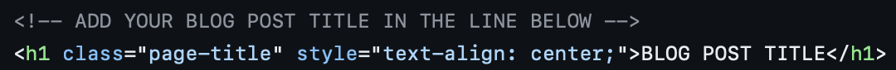
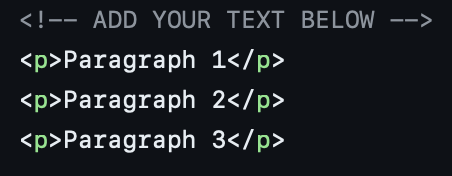
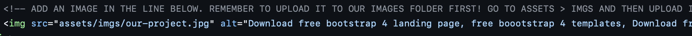
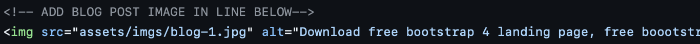
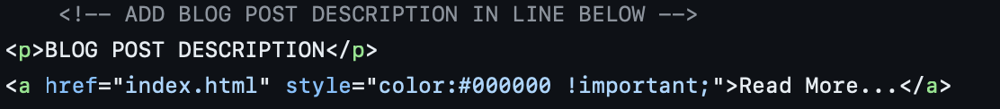

# ParKit
This Git Repository is the home of all files relevant to ParKit@Smith's website! 

Continue reading below [for a basic guide to editing](#guide-to-basic-editing).

## Guide to Basic Editing

The page files may look scary at first, but editing them is simple! In this short guide, we'll address some of the most common edits and how to do them!

## But First: Where/How Do You Edit?

Our project repository is hosted on a website called [Github](https://github.com). Log in using the following credentials:

    username: parkit
    password: 75OutletRestrict
    
You'll get to our repository homepage, and you'll see a list of all of our project files. Click on the one you want to edit. Then, in the top-right corner, there is an 'Edit' button, which looks like a pen. Click that and you can edit. 

After you are done editing, scroll down and you'll see the 'Commit' and 'Commit Message' boxes. These boxes are where you can name the change you made, and write a brief description of what you changed respectively. Please do not skip this as it helps us track who has changed what, especially if the website gets broken!

After you have filled out the Commit boxes, press the green Commit button, and you are done!
    
### Editing a Paragraph

1. Head to the webpage that holds the paragraph you want to edit.
2. The information for the content and design of each webpage is housed in separate HTML files that we have in our GitHub repository. For example, the "Our Instructables" webpage's information is housed in a file called `instructables.html`, and the "Gallery" webpage's information is housed ina  file called `gallery.html`. Find the correct HTML for your target webpage. Click on it to open it.
3. Now, you'll see a bunch of scary-looking text, but no fear! Find the pencil icon in the top right corner to edit the HTML information.
4. Now, go back to the normal webpage, and find a slice of text from the paragraph you want to edit. Copy that text.
5. Go back to the HTML Editing page and use the Find tool (command+F) to Find the sentence you copied from your paragraph within the HTML document. This is how you can find the text of paragraph that you want to edit buried in all of the extra HTML information.
6. Now, edit the paragraph how you want! If you want to insert a NEW paragraph, press Return, and then type the following: `

`. Between the two middle carrots is where you type your new paragraph, like:

   `
New paragraph awesome text yay!
`

7. Once you're done editing, press the big green "Commit Changes" button on the top righthand corner of the editing page. You'll be asked to write a Commit message to detail what you edited, so you can just write a short description and then press Commit!
8. Done!

### Adding a Photo

Congratulations! You have an amazing new photo to add to the website. Before we do anything, we want to upload our photo to our GitHub repository so that our webpage has access to display it. 

1. Make sure your image is a .png, .jpg, or .jpeg. Make sure it has a descriptive, but short, name!
2. Go to our GitHub repository and first navigate to the `assets` folder, and then `imgs` folder. Then, use the top-right `Add file` button and upload your image.
3. Now, the procedure is very similar to editing a paragraph! Go back to the main GitHub repository homepage. The information for the content and design of each webpage is housed in separate HTML files that we have in our GitHub repository. For example, the "Our Instructables" webpage's information is housed in a file called `instructables.html`, and the "Gallery" webpage's information is housed ina  file called `gallery.html`. Find the correct HTML for your target webpage. Click on it to open it.
4. Now, you'll see a bunch of scary-looking text, but no fear! Find the pencil icon in the top right corner to edit the HTML information.
4. Now, go back to the normal webpage, and find the last sentence of text before the place you want to add a photo. Copy that sentence.
5. Go back to the HTML Editing page and use the Find tool (command+F) to Find the sentence you copied from your paragraph within the HTML document. This is how you can find the correct place to insert your photo buried in all of the extra HTML information.
6. Then, press return to create a new line, and paste the following: ``. So, for example, if I had a photo called `tree.jpeg` that I have uploaded, I would paste the following: ``
7. Done!

### Adding a Blog Post

Adding a blog post requires putting skills together that you have used to edit a paragraph and add a photo! In our repository, you will see a document called `blog_post_template.html`. Download this document to your computer and rename your downloaded document to a short name of your blog post, such as `blog-1.html`. Then, upload this document back to our repository.

Now, you can edit this document right in GitHub! Here are the steps to edit it and add your blog post:

1. Click on your document in the repository. You should get to a screen with your document that shows a bunch of HTML text that make up the style and content of your document.
2. Click on the pencil tool in the upper-right corner. This is your edit button.
3. Now, you should be redirected to a window where you can edit the contents of your document. There are helpful comments highlighted in grey text which guide you on where to type to edit the document with your blog post's contents. See the relevant examples below:

This photo shows you where to edit the title of your blog post's page.

This photo shows you where to edit the text content of your blog post.

This photo shows you where to edit the photo on your blog post's page. Make sure to upload your image to this GitHub repository first (upload it in the folder called `blog_post_images`!), then replace the existing path (which is currently "assets/imgs/our-project.jpg") with the correct path to your image.

5. Once you've replaced the template with your blog post's information/contents, the last step is to hit the green `Commit changes...` button in the upper-right corner. You will be prompted to add a commit message to describe what you have updated in the document. Write a short note as to what you have done to the document, such as, `added blog post about our recent deployment in downtown Northampton` and then press `Commit changes`. Now, your blog post has a webpage! Now, we have to provide a way for website visitors to actually get to your blog's webpage.

To do this, we need to go back to the homepage of our GitHub repository that lists all of the documents that make up our website. Here are the steps to create a link to your new blogpost on our website:

1. Find the page titled `research.html` and click on it.
2. Click on the pencil tool in the upper-right corner. This is your edit button.
3. Now, you should be redirected to a window where you can edit the contents of your document. Again, we will be using the comments highlighted in grey text to help us update what we need to to link our blog post. See the relevant examples below:

This photo shows you where to edit the photo of your blog post's card.

This photo shows you where to edit the title of your blog post's card.

This photo shows you where to edit the short description/summary of your blog post's page. In the line just below the comment in the image with `<a href="index.html"...`, replace `index.html` with the correct name of your blog page. Remember when you downloaded the template document and then renamed the downloaded document to something like `blog-1.html`? `blog-1.html` would be what you would replace `index.html` with!

5. Once you've updated our `research.html` page with your blog post's information, the last step is to hit the green `Commit changes...` button in the upper-right corner. You will be prompted to add a commit message to describe what you have updated in the document. Write a short note as to what you have done to the document, such as, `added downtown northampton installation blog post to our blog post page` and then press `Commit changes`. Now, people can access your blog post's webpage from our webpage that spotlights our research on our website! Wait for five minutes for our website to update, and then you can double-check that your blog post has published successfully at [this link](https://parkit-smith.github.io/parkit/research.html).

### Design Changes

Design changes generally require some familiarity with the structure and syntax of HTML and CSS. If you feel confident enough in your understanding of the structure of the webpage, feel free to make minor design changes. However, if you are at all unsure, contact Laura and she will see if what you want is possible!
